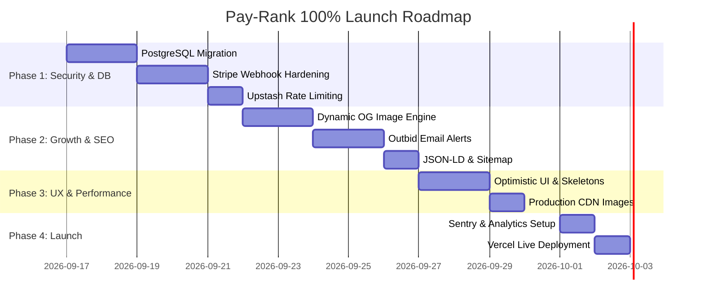

# 🚀 Pay-Rank SaaS: 100% Launch Readiness & Optimization Blueprint

A comprehensive, production-grade roadmap to transform **Pay-Rank** into a bulletproof, scalable, high-converting, and viral pay-to-rank SaaS directory.

---

## 📋 Executive Summary

**Pay-Rank** introduces a transparent, bid-to-rank public directory model (similar to outbid / attention-market models). To transition this codebase from a local development application into a 100% launch-ready, enterprise-grade SaaS generating sustainable revenue, actions must be taken across **7 core domains**:

1. Database Scaling & Infrastructure
2. Stripe Payments & Financial Security
3. Cybersecurity, Auth & Fraud Prevention
4. Performance Optimization & CDN Caching
5. Viral Growth Engine, OpenGraph & Technical SEO
6. UX, Accessibility & Conversion Rate Optimization (CRO)
7. Monitoring, Analytics & Operational Alerts

---

## 🗄️ 1. Backend Architecture & Database Scaling

| Current State | Target Launch State | Implementation Action |
| :--- | :--- | :--- |
| Local SQLite (`dev.db`) | Managed PostgreSQL (Supabase / Neon / AWS RDS) | Migrate Prisma provider to `postgresql` with connection pooling |
| Single instance queries | PgBouncer / Prisma Accelerate | Prevent connection exhaustion under viral traffic spikes |
| Seed script in `/api/seed` | Environment-aware DB migrations | Restrict seed endpoints to `NODE_ENV === 'development'` |

### Action Steps:
- [ ] **PostgreSQL Migration**: Swap SQLite for Neon or Supabase PostgreSQL for multi-region read replicas and instant point-in-time recovery.
- [ ] **Index Optimization**: Ensure compound DB indexes on `[normalized_city, total_paid_cents(sort: Desc)]` and `[cuisine, total_paid_cents(sort: Desc)]` for sub-10ms query execution.
- [ ] **Database Connection Pooling**: Implement `@prisma/extension-accelerate` or PgBouncer to sustain 10,000+ simultaneous WebSocket & HTTP connections.

---

## 💳 2. Stripe Payment Operations & Financial Security

| Feature | Current State | Required Launch Setup |
| :--- | :--- | :--- |
| Payment Gateway | Mock payment toggle enabled | Live Stripe API keys (`pk_live_...` & `sk_live_...`) |
| Webhook Verification | Basic endpoint | Signed webhook handler verifying `stripe-signature` |
| Top-up & Outbid Receipts | Local state update | Automatic PDF receipts & rank change notification emails via Resend / Postmark |

### Action Steps:
- [ ] **Webhook Idempotency**: Store `stripePaymentIntentId` and `stripeSessionId` in database payment records; return `200 OK` on duplicate webhook events to prevent double-crediting.
- [ ] **Outbid Email Notifications**: When Listing A outbids Listing B for Rank #1, automatically trigger a transactional email to Listing B: *"You've been outbid on Pay-Rank! Reclaim Rank #1 now."* (Highest ROI conversion trigger).
- [ ] **Refund & Chargeback Policy**: Set up Stripe Radar fraud rules and a clear Terms of Service stating bid payments are non-refundable bid transactions.

---

## 🛡️ 3. Security, Rate Limiting & Fraud Prevention

| Security Area | Threat Vector | Mitigation Strategy |
| :--- | :--- | :--- |
| Public API Routes | Denial of Service / API Abuse | Upstash Redis Rate Limiting (`@upstash/ratelimit`) |
| Form Submissions | Spam Listings & Bot Bids | Cloudflare Turnstile or Google reCAPTCHA v3 on claim forms |
| Listing Ownership | Edit token query params | Magic link authentication for listing owners to update details |

### Action Steps:
- [ ] **API Rate Limiting**: Limit `/api/restaurants` POST requests to 5 requests per IP per minute; limit `/api/leaderboard` GET requests to 100 per minute.
- [ ] **Input Sanitization & XSS Protection**: Use `zod` for strict schema validation on all incoming payload fields (`name`, `city`, `cuisine`, `description`, `logoUrl`).
- [ ] **Security Headers**: Add `Content-Security-Policy`, `X-Frame-Options: DENY`, `X-Content-Type-Options: nosniff`, and `Strict-Transport-Security` in `next.config.js`.

---

## ⚡ 4. Performance, Caching & Deployment Strategy

- [ ] **Edge Network Caching**: Configure Next.js `revalidate` headers (ISR - Incremental Static Regeneration) for static directory pages: `Cache-Control: s-maxage=60, stale-while-revalidate=300`.
- [ ] **Image CDN Optimization**: Replace external image URLs (e.g. Unsplash) with an optimized image proxy (Vercel Blob / Cloudinary) using Next.js `<Image />` component with webp/avif encoding.
- [ ] **Bundle Compression**: Tree-shake `lucide-react` imports and ensure dynamic imports for heavy modals (`CalculatorModal`, `EntryDetailsModal`).

---

## 📈 5. Viral Growth Engine, OpenGraph & Technical SEO

### A. Dynamic Social Cards (Viral Engine)
- [ ] **Dynamic Open Graph Images**: Implement `@vercel/og` to dynamically generate custom OG images when sharing a listing or category:
  - Example OG Image text: *"Monal Executive Restaurant is currently #1 Pakistani Restaurant on Pay-Rank with $1,250 bid volume."*
- [ ] **Automated X / Twitter Rank Bot**: Build a simple cron background worker that tweets whenever a new #1 rank record is set.

### B. Technical SEO
- [ ] **Structured Data (JSON-LD)**: Inject Schema.org `ItemList` and `LocalBusiness` data into directory pages for rich Google Search snippet eligibility.
- [ ] **Dynamic Sitemap Generator**: Auto-generate `sitemap.xml` including all city directory routes (`/city/[cityName]`) and category routes (`/category/[cuisine]`).

---

## 🎨 6. UX Excellence, Accessibility & CRO

- [ ] **Optimistic UI Updates**: Instantly update rank positions in the local UI state before the server fetch finishes to eliminate perceived latency.
- [ ] **Skeleton Loaders**: Show shimmering loading skeletons for cards during initial page loads rather than spinner layouts.
- [ ] **Keyboard & Screen Reader Accessibility**: Ensure all custom dropdowns, tabs, and modals pass WCAG 2.1 AA standards (`aria-haspopup`, `aria-expanded`, `tabIndex`).

---

## 📊 7. Analytics, Error Tracking & Monitoring

- [ ] **Sentry Error Monitoring**: Integrate `@sentry/nextjs` to automatically catch and log frontend and server-side runtime exceptions with full stack traces.
- [ ] **PostHog Product Analytics**: Track conversion funnel steps:
  1. `claim_widget_viewed`
  2. `calculator_opened`
  3. `checkout_started`
  4. `checkout_completed`
- [ ] **Uptime & Health Monitoring**: Set up Better Stack or Datadog ping checks on `https://your-domain.com/api/health`.

---

## 🗺️ Execution Roadmap

---

> 💡 **Summary**: By completing these phases, **Pay-Rank** will achieve enterprise reliability, viral organic distribution, robust security against fraud, and maximum conversion rates for listing bids.
